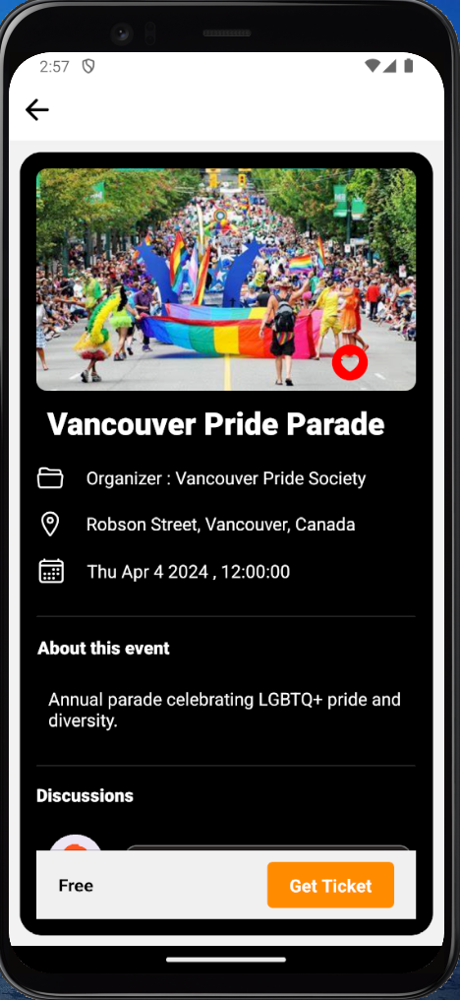

## Overview
EventUp is an ongoing React Native application designed to help users discover, book, and manage events effortlessly. While the app is still in development, it already offers a range of features aimed at enhancing the event experience for users. The events are fetched from my database for the scpe of this project.

### Mockups
**Login Screen**

**Home Screen**

**Event details Page**

**Confirm Booking Screen**

![booking-screen](./public/images/confirmBooking.png

**Favorites Screen**

**Tickets Screen**

**Profile Screen**

## Install with npm

- npm install
- npx expo start